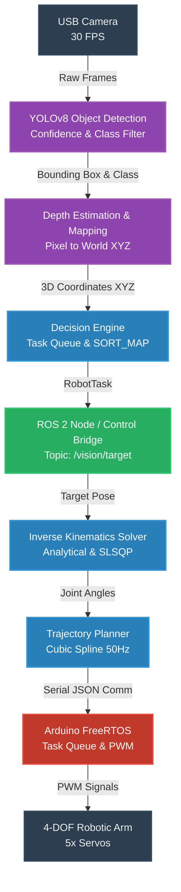

# 🤖 AI Vision + Robotic Arm

> A production-ready, dual-thread Python system that fuses **real-time YOLO object detection** with **analytical inverse kinematics** to autonomously sort and manipulate objects using a 4-DOF robotic arm.

---

## 📋 Table of Contents

- [Overview](#overview)
- [System Architecture](#system-architecture)
- [Features](#features)
- [Project Structure](#project-structure)
- [Hardware Requirements](#hardware-requirements)
- [Installation](#installation)
- [Configuration](#configuration)
- [Usage](#usage)
- [Modules](#modules)
- [Inverse Kinematics](#inverse-kinematics)
- [Testing](#testing)
- [Development](#development)

---

## 🚀 Project Overview

This project implements a production-grade, end-to-end **AI-powered pick-and-place robotic arm** pipeline. Designed as an enterprise-ready portfolio project, it seamlessly integrates advanced Computer Vision (YOLOv8), analytical Inverse Kinematics, the **Robot Operating System (ROS 2)**, and a **Real-Time Operating System (FreeRTOS)** on the hardware layer. 

A USB camera feeds into a high-performance vision thread that detects, maps to 3D coordinates, and tracks objects. The intelligent decision engine routes tasks to an automated pipeline, where inverse kinematics solves the exact joint angles. Commands are then executed via a real-time FreeRTOS-controlled Arduino, ensuring the **30 FPS vision loop is never blocked** by the arm's physical motion.

### 🎥 Demo

*(Placeholder for Demo GIF/Video)*


*The system autonomously detecting objects, calculating 3D coordinates, and commanding the arm to pick and sort them into respective bins.*

---

## System Architecture



### Data Flow

| Step | Input | Output | Module |
|------|-------|--------|--------|
| 1 | Raw frame | Undistorted 640×640 | `preprocess.py` |
| 2 | BGR frame | Depth map (float32) | `depth.py` |
| 3 | BGR frame | `DetectionResult` | `detect.py` |
| 4 | Pixel (u,v) | World XYZ [m] | `depth.py` |
| 5 | `DetectionResult` | `RobotTask` | `decision.py` |
| 6 | Target XYZ | `JointAngles` [°] | `kinematics.py` |
| 7 | `JointAngles` | Trajectory points | `trajectory.py` |
| 8 | Trajectory | Serial JSON | `control.py` |

---

## Features

### Vision Pipeline
- **YOLOv8** object detection with letterbox preprocessing (aspect-ratio-correct)
- **FP16 inference** on CUDA for ~2× throughput
- **Frame-skip** mode — run heavy YOLO inference every N frames, return cached result between frames
- **Model warm-up** on startup to eliminate the first-frame latency spike
- **Configurable target classes** (cup, bottle, book, cell phone, scissors, remote, keyboard, mouse, apple, orange)
- **Depth estimation**: monocular MiDaS, Intel RealSense D435, or planar homography fallback
- **Centroid tracker** with Kalman-filtered positions — eliminates jitter in pick targets

### Intelligent Task Planner (Decision Engine)
- **Environment Analysis (Scene Graph)** — Scans all tracked objects and builds a semantic understanding of the workspace before acting.
- **Semantic Prioritization** — Overrides raw visual confidence with safety rules: `Hazardous (100) > Recyclable (80) > Organic (60) > General (40)`.
- **Plan Queue Execution** — Formulates a sequential plan for multiple objects instead of reacting frame-by-frame.
- **Temporal consensus** — Object must appear in N consecutive frames before action (default: 4).
- **Explainable AI Logging** — Outputs human-readable reasoning for every decision to the terminal and video HUD.
- **Bin routing (SORT_MAP)**:

  | Object | Bin |
  |--------|-----|
  | bottle, cup, can | ♻️ recycle |
  | cell phone, mouse, remote, keyboard | ⚠️ hazardous |
  | book, scissors | 🗑️ general |
  | apple, orange, banana | 🌿 organic |
  | *defective items (QC fail)* | ⛔ reject |

### Inverse Kinematics
- **Analytical IK** (closed-form, ~0.1ms) for the 4-DOF planar arm
- **SLSQP numerical fallback** with joint-limit constraints when target is at workspace boundary
- **Singularity detection** via Jacobian condition number (warns when condition > 80)
- **Velocity safety check** — rejects moves with joint delta > 45°/step
- Configurable **elbow-up / elbow-down** preference

### Trajectory Planning
- **Cubic Spline Planner** (C¹ continuity) — smooth multi-waypoint trajectories: `home → pick → lift → drop → home`
- **Trapezoidal Planner** — constant-acceleration bang-coast-bang profile for fast point-to-point
- Trajectories sampled at **50 Hz** and clamped to joint limits

### Robot Controller
- **Non-blocking command queue** — vision loop never waits for serial ACK
- **Retry logic** with exponential back-off (up to 3 attempts per command)
- **Auto-detect** USB port (scans for Arduino / CH340 / CP210 adapters)
- **Dry-run mode** — simulates all serial commands, safe for development without hardware
- **Emergency stop** bypasses the queue and sends `estop` immediately
- JSON protocol over serial at **115200 baud**

### Performance Dashboard (HUD)
- Live FPS counter
- IK solve time (ms)
- Pick / drop counts
- Current task and bin label overlaid on the video feed

---

## 🗺️ Roadmap & Milestones

- [x] **Core Vision Pipeline**: YOLOv8 integration and inference loop.
- [x] **Coordinate Mapping**: 2D pixel to 3D World XYZ (Monocular/Stereo).
- [x] **Decision Engine**: Multi-frame consensus and priority sorting logic.
- [x] **Inverse Kinematics**: Closed-form analytical solver + SLSQP fallback.
- [x] **ROS 2 Integration**: Basic bridging nodes for ROS ecosystem.
- [x] **RTOS Firmware**: FreeRTOS integration on Arduino for deterministic servo control.
- [ ] **Real Robotic Arm Setup**: Hardware assembly, calibration, and fine-tuning.
- [ ] **Advanced Grasping**: Integration of a depth camera for 6D pose estimation.

---

## Project Structure

```
ai robotic arm/
├── src/
│   ├── main.py                  # Entry point — ArmPipeline, CLI
│   ├── vision/
│   │   ├── preprocess.py        # Camera undistortion, resize, CLAHE
│   │   ├── detect.py            # YOLOv8 wrapper, Detection dataclasses
│   │   ├── depth.py             # CoordinateMapper, MonocularDepthEstimator
│   │   └── tracker.py           # CentroidTracker, Kalman filter
│   ├── robotics/
│   │   ├── kinematics.py        # IKSolver, JointAngles, Jacobian
│   │   ├── trajectory.py        # CubicSplinePlanner, TrapezoidalPlanner
│   │   ├── control.py           # RobotController (serial, queue, retry)
│   │   └── calibration.py       # Camera-to-robot coordinate calibration
│   ├── logic/
│   │   └── decision.py          # DecisionEngine, RobotTask, SORT_MAP
│   └── utils/
│       ├── config.py            # Pydantic config loader (config.yaml + .env)
│       └── logger.py            # Loguru structured logger setup
├── tests/
│   ├── test_tracker.py
│   ├── test_kinematics.py
│   ├── test_trajectory.py
│   └── test_decision.py
├── docs/
│   ├── architecture.md          # System diagram & data-flow table
│   └── ik_derivation.md         # Mathematical derivation of the IK solver
├── models/
│   └── yolo/                    # Place your trained best.pt here
├── notebooks/                   # Jupyter notebooks for experiments
├── scripts/                     # Utility / calibration scripts
│   ├── hand_eye_calibration.py  # Interactive calibration
│   └── evaluate_accuracy.py     # Automated validation & reporting
├── data/                        # Datasets, calibration images
├── config.yaml                  # All tunable parameters
├── .env.example                 # Environment variable template
├── requirements.txt
└── setup.cfg
```

---

## Hardware Requirements

| Component | Specification |
|-----------|--------------|
| Robotic Arm | 4-DOF servo arm (5 servos) |
| Microcontroller | Arduino (any variant with USB serial) |
| Camera | USB webcam, min 720p @ 30fps |
| PC / Host | Python 3.9+, CUDA GPU recommended |
| Depth Sensor | *(Optional)* Intel RealSense D435 or stereo camera |

### Arm Link Lengths (defaults)

| Link | Length |
|------|--------|
| L1 — base to shoulder | 105 mm |
| L2 — upper arm | 105 mm |
| L3 — forearm | 90 mm |
| L4 — wrist to gripper | 60 mm |
| **Max reach** | **255 mm** |

> Measure your physical arm and update `config.yaml` accordingly.

---

## Installation

### 1. Clone the repository

```bash
git clone https://github.com/Punk1107/ai-vision-robotic-arm.git
cd "ai-vision-robotic-arm"
```

### 2. Create a virtual environment

```bash
python -m venv .venv

# Windows
.venv\Scripts\activate

# Linux / macOS
source .venv/bin/activate
```

### 3. Install dependencies

```bash
pip install -r requirements.txt
```

> **CUDA users:** Install the matching PyTorch CUDA build from [pytorch.org](https://pytorch.org) before running `pip install -r requirements.txt`.

### 4. Configure environment

```bash
cp .env.example .env
# Edit .env with your serial port and preferences
```

### 5. Place your YOLO model

```
models/yolo/best.pt   ← your custom-trained YOLOv8 weights
```

If no custom model is found, the system automatically falls back to the standard `yolov8n.pt` pretrained weights.

---

## Configuration

All parameters are controlled from `config.yaml`. No source code changes are needed for hardware adjustments.

```yaml
camera:
  device_id: 0          # OpenCV camera index
  width:  1280
  height: 720
  fps:    30

yolo:
  model_path: models/yolo/best.pt
  fallback_model: yolov8n.pt
  confidence_threshold: 0.45
  iou_threshold: 0.45
  input_size: 640
  target_classes:
    - cup
    - bottle
    - book
    - cell phone
    - scissors
    - remote
    - keyboard
    - mouse
    - apple
    - orange

robotics:
  serial_port: COM3      # /dev/ttyUSB0 on Linux/macOS
  baud_rate:   115200
  l1: 0.105              # Link lengths in metres
  l2: 0.105
  l3: 0.090
  l4: 0.060
  move_speed: 50
  home_speed: 30

depth:
  enabled: false         # Enable monocular/stereo depth
  method:  monocular     # monocular | stereo | realsense
  monocular_model: MiDaS_small

log_level:   INFO
debug_video: true        # Show annotated camera window
dry_run:     false       # true = skip all serial commands
```

### Environment Variables (`.env`)

```dotenv
ROBOT_SERIAL_PORT=COM3
YOLO_CONFIDENCE=0.45
DRY_RUN=false
```

---

## Usage

### Basic run (sort mode)

```bash
python -m src.main
```

### CLI Options

```bash
python -m src.main [OPTIONS]

Options:
  --mode [sort|pick]   Task mode (default: sort)
  --frame-skip INT     Run YOLO every N frames; tracker interpolates (default: 2)
  --dry                Dry-run mode — no serial commands sent
  --port TEXT          Override serial port (e.g. COM5, /dev/ttyUSB0)
  --conf FLOAT         Override YOLO confidence threshold
  --debug/--no-debug   Toggle annotated video window (default: on)
  --camera INT         OpenCV camera device index (default: 0)
```

### Examples

```bash
# Sort mode with depth enabled, camera 1
python -m src.main --mode sort --camera 1

# Pick mode, dry run (no hardware needed)
python -m src.main --mode pick --dry

# High-confidence, run YOLO every frame, custom port
python -m src.main --conf 0.65 --frame-skip 1 --port /dev/ttyUSB0

# Headless (no video window)
python -m src.main --no-debug
```

Press **`q`** in the video window or **`Ctrl+C`** in the terminal to stop.

---

## Modules

### `src/vision/detect.py` — Object Detector

```python
from src.vision.detect import ObjectDetector

detector = ObjectDetector(frame_skip=2)
result   = detector.detect(frame)         # → DetectionResult
# result.detections  : List[Detection]
# result.inference_ms: float
```

Each `Detection` carries: `class_name`, `confidence`, `bbox_xyxy`, `center_px`, `area_px`, `world_xyz`, `track_id`.

### `src/vision/depth.py` — Coordinate Mapper

```python
from src.vision.depth import CoordinateMapper

mapper    = CoordinateMapper(strategy="plane")   # or "depth"
world_xyz = mapper.map(cx_px, cy_px, depth_map)  # → np.ndarray [X,Y,Z] metres
```

### `src/robotics/kinematics.py` — IK Solver

```python
from src.robotics.kinematics import IKSolver
import numpy as np

ik     = IKSolver(elbow_up=True)
angles = ik.solve(np.array([0.15, 0.10, 0.05]), wrist_pitch_deg=-90)
# → JointAngles(base, shoulder, elbow, wrist, gripper)
```

### `src/robotics/trajectory.py` — Trajectory Planner

```python
from src.robotics.trajectory import pick_place_trajectory, CubicSplinePlanner

traj = pick_place_trajectory(
    home=home_angles, pick=pick_angles,
    lift=lift_angles, drop=drop_angles,
    t_per_segment=1.0,
)
# → List[TrajectoryPoint]  sampled at 50 Hz
```

### `src/robotics/control.py` — Robot Controller

```python
from src.robotics.control import RobotController

with RobotController() as ctrl:
    ctrl.home()
    ctrl.move_to(angles, blocking=False)
    ctrl.grip(close=True)
    ctrl.play_trajectory(traj)
    ctrl.emergency_stop()   # bypass queue immediately
```

### `src/logic/decision.py` — Intelligent Task Planner

```python
from src.logic.decision import DecisionEngine

planner = DecisionEngine(mode="sort", confirm_frames=4, enable_qc=True)
task   = planner.decide(detections, frame_area=640*480)
# The planner maintains an internal queue and semantic scene graph
# task.task_type  : TaskType.SORT | PICK | IDLE
# task.target_xyz : np.ndarray
# task.bin_label  : "recycle" | "hazardous" | "organic" | "general" | "reject"
```

---

## Inverse Kinematics

The arm uses a **closed-form analytical solution** for the standard 4-DOF revolute-joint configuration.

```
      z
      |   θ2
L1    |  /L2
[base]─┴─[shoulder]──[elbow θ3]──[wrist θ4]──◉ EE
      θ1 (rotation around Z)
```

**Step 1 — Base angle:**
```
θ1 = atan2(Y, X)
```

**Step 2 — Remove wrist contribution:**
```
r = sqrt(X² + Y²) − L4·cos(θ4_desired)
z = (Z − L1)      − L4·sin(θ4_desired)
```

**Step 3 — 2R planar IK (elbow-up):**
```
D  = (r² + z² − L2² − L3²) / (2·L2·L3)
θ3 = atan2(−sqrt(1−D²), D)
θ2 = atan2(z, r) − atan2(L3·sin(θ3), L2 + L3·cos(θ3))
```

**Step 4 — Wrist compensation:**
```
θ4 = θ4_desired − θ2 − θ3
```

When `|D| > 1` (target unreachable analytically), the solver automatically falls back to **SLSQP numerical optimisation** with joint-limit inequality constraints.

| Workspace limit | Value |
|-----------------|-------|
| Max reach | L2 + L3 = 195 mm |
| Min reach | \|L2 − L3\| = 15 mm |
| Base rotation | ±90° |

For the full derivation see [`docs/ik_derivation.md`](docs/ik_derivation.md).

---

## Testing

```bash
# Run all tests
pytest

# Run with coverage report
pytest --cov=src --cov-report=term-missing

# Run a specific test file
pytest tests/test_kinematics.py -v
```

### Accuracy Evaluation

To formally validate the precision of the hand-eye calibration and IK solver, run the automated accuracy evaluator:

```bash
python scripts/evaluate_accuracy.py --points 5
```

This will command the arm to move to 5 known 3D coordinates, compare them against the camera's spatial estimate, and generate a markdown report (`docs/accuracy_report.md`) detailing the **Mean Absolute Error (MAE)** and **RMSE**.

Test files:

| File | Coverage |
|------|----------|
| `test_kinematics.py` | IK solver — analytical, numerical, singularity, reachability |
| `test_tracker.py` | CentroidTracker — update, deregister, max_distance |
| `test_trajectory.py` | CubicSpline & Trapezoidal planners, pick_place_trajectory |
| `test_decision.py` | DecisionEngine — consensus, cooldown, SORT_MAP, priority scoring |

---

## Development

### Code Style

```bash
# Format
black src/ tests/

# Lint
flake8 src/ tests/
```

### Dry-run development (no hardware)

```bash
python -m src.main --dry --no-debug
```

In dry-run mode all serial commands are logged but never sent. This lets you develop and test the full pipeline without a physical arm.

### Adding a new target class

1. Add the class name to `target_classes` in `config.yaml`
2. Add a bin mapping in `SORT_MAP` in `src/logic/decision.py`
3. If needed, add a `DROP_ZONES` entry for a new bin

### Enabling depth estimation

Set `depth.enabled: true` in `config.yaml` and choose a method:

| Method | Hardware | Notes |
|--------|----------|-------|
| `monocular` | Any webcam | Uses MiDaS (install via `torch.hub`) |
| `realsense` | Intel D435 | Uncomment `intel-realsense` in requirements.txt |
| `stereo` | Stereo camera | Requires calibrated stereo setup |

---

## License

This project is intended for educational and portfolio purposes.

---

*Built with ❤️ using Python · YOLOv8 · OpenCV · PyTorch · SciPy · PySerial*
