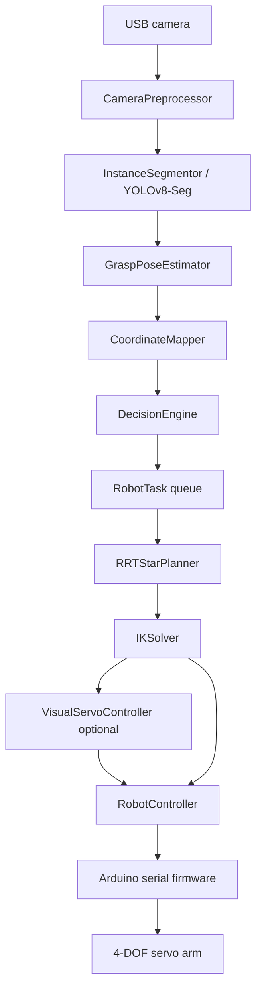

# AI Vision Robotic Arm

A Python project for a camera-guided 4-DOF robotic arm. The system combines
YOLOv8/YOLOv8-Seg vision, object tracking, task planning, inverse kinematics,
trajectory generation, and serial control for pick-and-place or sorting demos.

The code is designed to run in dry-run mode without hardware, then switch to a
real Arduino-controlled arm once calibration and serial settings are ready.

## Contents

- [Overview](#overview)
- [Architecture](#architecture)
- [Features](#features)
- [Project Layout](#project-layout)
- [Hardware](#hardware)
- [Installation](#installation)
- [Configuration](#configuration)
- [Usage](#usage)
- [Testing](#testing)
- [Key Modules](#key-modules)
- [Calibration](#calibration)

## Overview

The main runtime is `src/main.py`. It starts two cooperating threads:

1. Vision thread: reads camera frames, preprocesses them, runs instance
   segmentation, estimates grasp pose and XYZ coordinates, tracks objects, and
   asks the decision engine for the next task.
2. Control thread: consumes `RobotTask` objects, plans an approach path, solves
   inverse kinematics, moves the arm, grips/releases, and returns home.

The task queue is intentionally small so old targets do not pile up while the
physical arm is moving.

## Architecture



### Runtime Data Flow

| Step | Input | Output | Main module |
| --- | --- | --- | --- |
| 1 | Raw BGR frame | Resized/undistorted frame | `src/vision/preprocess.py` |
| 2 | Frame | Segmented objects and masks | `src/vision/segmentation.py` |
| 3 | Segment + depth map | Grasp pose and world XYZ | `src/vision/pose.py` |
| 4 | Segmentations | Stable object tracks | `src/vision/tracker.py` |
| 5 | Tracks | `RobotTask` | `src/logic/decision.py` |
| 6 | Start/goal XYZ | Cartesian waypoints | `src/robotics/path_planning.py` |
| 7 | Target XYZ | `JointAngles` | `src/robotics/kinematics.py` |
| 8 | Joint angles | Serial JSON commands | `src/robotics/control.py` |

See [docs/architecture.md](docs/architecture.md) for a fuller architecture note.

## Features

### Vision

- YOLOv8 object detection support through `ObjectDetector`.
- YOLOv8-Seg instance segmentation through `InstanceSegmentor`.
- Frame skipping to reduce inference load.
- CUDA FP16 inference when available.
- Mask PCA for object orientation and wrist-angle estimation.
- Optional depth backends: RealSense or MiDaS monocular depth.
- Planar coordinate fallback when depth is disabled.
- Centroid tracking with Kalman smoothing.

### Decision Logic

- Sort or pick mode.
- Semantic bin routing:

| Class | Bin |
| --- | --- |
| `bottle`, `cup`, `can` | `recycle` |
| `cell phone`, `mouse`, `remote`, `keyboard` | `hazardous` |
| `apple`, `orange`, `banana` | `organic` |
| `book`, `scissors` | `general` |
| unknown classes | `unknown` |
| QC failures | `reject` |

- Priority scoring by semantic category, confidence, track age, and proximity.
- Short plan queue for multi-object scenes.
- Global and per-class cooldowns.
- Adaptive recovery if the active target drifts while the arm approaches.
- Optional quality-control inspection before pick.

### Robotics

- Analytical IK for the 4-DOF arm.
- SLSQP numerical IK fallback.
- Joint limit clamping and singularity warnings.
- Cartesian RRT* path planning with optional smoothing.
- Cubic spline and trapezoidal joint-space trajectory planners.
- Non-blocking serial command queue with retry logic.
- Dry-run mode for development without hardware.

## Project Layout

```text
ai robotic arm/
  config.yaml
  README.md
  requirements.txt
  setup.cfg
  data/
    dataset.yaml
  docs/
    architecture.md
    ik_derivation.md
  notebooks/
    01_exploration.ipynb
  scripts/
    calibrate_camera.py
    evaluate_accuracy.py
    hand_eye_calibration.py
    test_vision.py
    arduino/arm_firmware/arm_firmware.ino
  src/
    main.py
    logic/
      decision.py
      quality_control.py
    robotics/
      calibration.py
      control.py
      kinematics.py
      path_planning.py
      trajectory.py
      visual_servo.py
    ros/
      ai_robotic_arm_ros/arm_node.py
    utils/
      config.py
      logger.py
    vision/
      depth.py
      detect.py
      pose.py
      preprocess.py
      segmentation.py
      tracker.py
  tests/
    test_decision.py
    test_kinematics.py
    test_tracker.py
    test_trajectory.py
```

## Hardware

| Component | Minimum |
| --- | --- |
| Robot arm | 4-DOF servo arm with gripper |
| Controller | Arduino-compatible board with USB serial |
| Camera | USB camera, 720p recommended |
| Host | Python environment with OpenCV and PyTorch |
| Depth sensor | Optional RealSense D4xx or monocular MiDaS |

Default arm dimensions in `src/utils/config.py`:

| Link | Default length |
| --- | --- |
| L1 base to shoulder | 0.105 m |
| L2 upper arm | 0.105 m |
| L3 forearm | 0.090 m |
| L4 wrist to gripper tip | 0.060 m |

Measure your physical arm and update `config.yaml` or `src/utils/config.py`
defaults before running on real hardware.

## Installation

```bash
python -m venv .venv

# Windows PowerShell
.venv\Scripts\Activate.ps1

# Linux/macOS
source .venv/bin/activate

pip install -r requirements.txt
```

For CUDA, install the matching PyTorch build from <https://pytorch.org> before
or after installing the rest of the requirements.

Copy the environment template if you want environment-variable overrides:

```bash
cp .env.example .env
```

## Configuration

Most runtime settings live in `config.yaml`.

Important settings:

| Key | Purpose |
| --- | --- |
| `camera.device_id` | OpenCV camera index |
| `yolo.model_path` | Custom detection model path |
| `segmentation.model_path` | Custom segmentation model path |
| `robotics.serial_port` | Arduino serial port, such as `COM3` |
| `depth.enabled` | Enables depth estimation backend |
| `path_planning.enabled` | Enables RRT* approach planning |
| `visual_servo.enabled` | Enables closed-loop visual servoing |
| `quality_control.enabled` | Enables defect inspection |
| `dry_run` | Simulates serial commands when true |

Environment variables supported by `src/utils/config.py`:

```dotenv
ROBOT_SERIAL_PORT=COM3
YOLO_CONFIDENCE=0.45
DRY_RUN=false
```

## Usage

Dry run without a video window:

```bash
python -m src.main --dry --no-debug
```

Sort mode with the default camera:

```bash
python -m src.main --mode sort
```

Pick mode on a custom serial port:

```bash
python -m src.main --mode pick --port COM5
```

Useful CLI options:

| Option | Meaning |
| --- | --- |
| `--mode sort|pick` | Selects task mode |
| `--frame-skip N` | Runs segmentation every N frames |
| `--dry` | Simulates serial commands |
| `--port PORT` | Overrides configured serial port |
| `--conf FLOAT` | Overrides YOLO confidence threshold |
| `--debug/--no-debug` | Shows or hides the OpenCV window |
| `--camera N` | Overrides camera index |

Stop with `q` in the video window or `Ctrl+C` in the terminal.

## Testing

Run the suite:

```bash
python -m pytest -q
```

If pytest cache writes are restricted in your environment:

```bash
$env:PYTEST_ADDOPTS="-p no:cacheprovider"
python -m pytest -q
```

Current test areas:

| Test file | Coverage |
| --- | --- |
| `tests/test_kinematics.py` | Forward/analytical IK, Jacobian, safety, reachability |
| `tests/test_tracker.py` | Track registration, pruning, smoothing, confidence |
| `tests/test_trajectory.py` | Cubic and trapezoidal trajectory planners |
| `tests/test_decision.py` | Task selection, bin routing, filtering, stats |

## Key Modules

### `src/vision/segmentation.py`

```python
segmentor = InstanceSegmentor(frame_skip=3)
result = segmentor.segment(frame)
best = result.best()
```

### `src/logic/decision.py`

```python
engine = DecisionEngine(mode="sort", confirm_frames=4)
task = engine.decide(result.segmentations, frame_area=640 * 480, frame=frame)
```

### `src/robotics/kinematics.py`

```python
ik = IKSolver(elbow_up=True)
angles = ik.solve(np.array([0.12, 0.20, 0.05]), wrist_pitch_deg=-90)
```

### `src/robotics/control.py`

```python
with RobotController() as ctrl:
    ctrl.home()
    ctrl.move_to(angles, blocking=True)
    ctrl.grip(close=True)
```

## Calibration

Camera intrinsics are expected at:

```text
data/calibration/camera_params.json
```

Generate camera intrinsics:

```bash
python scripts/calibrate_camera.py
```

For camera-to-robot alignment, use:

```bash
python scripts/hand_eye_calibration.py
```

Evaluate accuracy:

```bash
python scripts/evaluate_accuracy.py --points 5
```

The evaluator can produce a Markdown accuracy report when calibration and
hardware are available.

## Notes

- The default segmentation model falls back to `yolov8n-seg.pt` if no custom
  model exists.
- The default detection model falls back to `yolov8n.pt` if no custom model
  exists.
- RealSense support requires `pyrealsense2`, which is intentionally optional.
- ROS 2 support lives under `src/ros`, but the main Python pipeline can run
  without ROS.

## License

Educational and portfolio project.
