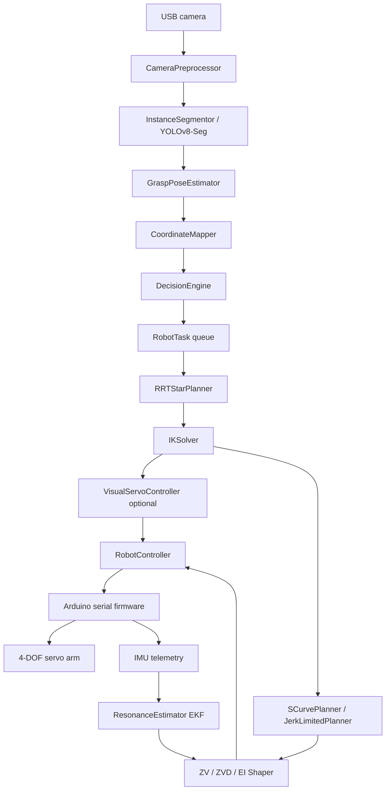

# AI Vision Robotic Arm

A Python project for a camera-guided 4-DOF robotic arm. The system combines
YOLOv8-Seg instance segmentation, Kalman-smoothed object tracking, AI task
planning, analytical + numerical inverse kinematics, RRT* path planning,
S-curve trajectory generation, ZV/ZVD input shaping, and real-time AI resonance
estimation for pick-and-place or sorting demonstrations.

The code is designed to run in dry-run mode without hardware, then switch to a
real Arduino-controlled arm once calibration and serial settings are ready.

## Contents

- [Overview](#overview)
- [Architecture](#architecture)
- [Features](#features)
- [Project Layout](#project-layout)
- [Hardware](#hardware)
- [Installation](#installation)
- [Configuration](#configuration)
- [Usage](#usage)
- [Testing](#testing)
- [Key Modules](#key-modules)
- [Input Shaping System](#input-shaping-system)
- [Calibration](#calibration)

## Overview

The main runtime is `src/main.py`. It starts two cooperating threads:

1. **Vision thread**: reads camera frames, preprocesses them, runs instance
   segmentation, estimates grasp pose and XYZ coordinates, tracks objects, and
   asks the decision engine for the next task.
2. **Control thread**: consumes `RobotTask` objects, plans an approach path,
   solves inverse kinematics, applies trajectory smoothing and input shaping,
   moves the arm, grips/releases, and returns home.

The task queue is intentionally small so old targets do not pile up while the
physical arm is moving.

## Architecture



### Runtime Data Flow

| Step | Input | Output | Main module |
| --- | --- | --- | --- |
| 1 | Raw BGR frame | Resized/undistorted frame | `src/vision/preprocess.py` |
| 2 | Frame | Segmented objects and masks | `src/vision/segmentation.py` |
| 3 | Segment + depth map | Grasp pose and world XYZ | `src/vision/pose.py` |
| 4 | Segmentations | Stable object tracks | `src/vision/tracker.py` |
| 5 | Tracks | `RobotTask` | `src/logic/decision.py` |
| 6 | Start/goal XYZ | Cartesian waypoints | `src/robotics/path_planning.py` |
| 7 | Target XYZ | `JointAngles` | `src/robotics/kinematics.py` |
| 8 | Joint angles | Smooth trajectory | `src/robotics/trajectory.py` |
| 9 | Trajectory | Vibration-suppressed trajectory | `src/robotics/shaping.py` |
| 10 | Shaped trajectory | Serial JSON commands | `src/robotics/control.py` |

See [docs/architecture.md](docs/architecture.md) for a fuller architecture note.

## Features

### Vision

- YOLOv8 object detection support through `ObjectDetector`.
- YOLOv8-Seg instance segmentation through `InstanceSegmentor`.
- Frame skipping to reduce inference load.
- CUDA FP16 inference when available.
- Mask PCA for object orientation and wrist-angle estimation.
- Optional depth backends: RealSense or MiDaS monocular depth.
- Planar coordinate fallback when depth is disabled.
- Centroid tracking with Kalman smoothing.

### Decision Logic

- Sort or pick mode.
- Semantic bin routing:

| Class | Bin |
| --- | --- |
| `bottle`, `cup`, `can` | `recycle` |
| `cell phone`, `mouse`, `remote`, `keyboard` | `hazardous` |
| `apple`, `orange`, `banana` | `organic` |
| `book`, `scissors` | `general` |
| unknown classes | `unknown` |
| QC failures | `reject` |

- Priority scoring by semantic category, confidence, track age, and proximity.
- Short plan queue for multi-object scenes.
- Global and per-class cooldowns.
- Adaptive recovery if the active target drifts while the arm approaches.
- Optional quality-control inspection before pick.

### Robotics

- Analytical IK for the 4-DOF arm with SLSQP numerical fallback.
- Joint limit clamping and singularity warnings via Jacobian condition number.
- Dynamic interception: predict and intercept moving objects with velocity regression.
- Cartesian RRT* path planning with greedy shortcutting smoothing.
- **Stage 1 — S-curve trajectory**: full 7-phase quintic S-curve with jerk limiting,
  plus jerk-limited and cubic-spline planners (all config-selectable).
- **Stage 2 — Input shaping**: ZV, ZVD, and EI shapers suppress residual vibration
  by convolving the trajectory with timed impulse sequences.
- **Stage 3 — Adaptive shaping**: EKF-based `ResonanceEstimator` continuously
  updates ωₙ and ζ from IMU telemetry, allowing the shaper to self-tune as the
  arm's configuration and payload change.
- Non-blocking serial command queue with retry logic and heartbeat.
- Dry-run mode for development without hardware.
- Optional closed-loop Image-Based Visual Servoing (IBVS) with three-axis PID.

## Project Layout

```text
ai robotic arm/
  config.yaml               ← all tuneable settings including input_shaping
  README.md
  requirements.txt
  setup.cfg
  data/
    dataset.yaml
  docs/
    architecture.md         ← full system architecture
    ik_derivation.md        ← IK math derivation
  notebooks/
    01_exploration.ipynb
  scripts/
    calibrate_camera.py
    evaluate_accuracy.py
    hand_eye_calibration.py
    measure_resonance.py    ← NEW: empirical ωₙ/ζ measurement tool
    test_vision.py
    arduino/
      arm_firmware/arm_firmware.ino
  src/
    main.py                 ← dual-thread pipeline + shaping stack init
    logic/
      decision.py
      quality_control.py
    robotics/
      ai_estimator.py       ← NEW: FFT / RLS / EKF resonance estimators
      calibration.py
      control.py            ← v3: IMU telemetry + shaper injection
      kinematics.py
      path_planning.py
      shaping.py            ← NEW: ZVShaper / ZVDShaper / EIShaper / AdaptiveShaper
      trajectory.py         ← v2: SCurvePlanner / JerkLimitedPlanner + acc[] field
      visual_servo.py
    ros/
      ai_robotic_arm_ros/arm_node.py
    utils/
      config.py             ← includes InputShapingConfig dataclass
      logger.py
    vision/
      depth.py
      detect.py
      pose.py
      preprocess.py
      segmentation.py
      tracker.py
  tests/
    test_decision.py
    test_kinematics.py
    test_tracker.py
    test_trajectory.py      ← 45 tests: planners, shapers, estimators
```

## Hardware

| Component | Minimum |
| --- | --- |
| Robot arm | 4-DOF servo arm with gripper |
| Controller | Arduino-compatible board with USB serial |
| Camera | USB camera, 720p recommended |
| Host | Python 3.10+ with OpenCV and PyTorch |
| Depth sensor | Optional RealSense D4xx or monocular MiDaS |
| IMU | Optional MPU-6050 at end-effector (enables Stage 3 adaptive shaping) |

Default arm dimensions in `config.yaml`:

| Link | Default length |
| --- | --- |
| L1 base to shoulder | 0.105 m |
| L2 upper arm | 0.105 m |
| L3 forearm | 0.090 m |
| L4 wrist to gripper tip | 0.060 m |

Measure your physical arm and update `config.yaml` before running on real hardware.

## Installation

```bash
python -m venv .venv

# Windows PowerShell
.venv\Scripts\Activate.ps1

# Linux/macOS
source .venv/bin/activate

pip install -r requirements.txt
```

For CUDA, install the matching PyTorch build from <https://pytorch.org> before
or after installing the rest of the requirements.

Copy the environment template if you want environment-variable overrides:

```bash
cp .env.example .env
```

## Configuration

All runtime settings live in `config.yaml`. Sections:

| Section | Purpose |
| --- | --- |
| `camera` | OpenCV device index, resolution, fps |
| `yolo` | Model path, confidence, class filter, input size |
| `robotics` | Serial port, link lengths, speed, workspace bounds |
| `depth` | Depth backend and monocular depth calibration |
| `segmentation` | Seg model, frame skip, min mask area |
| `grasp_pose` | Pose confidence and depth-noise thresholds |
| `path_planning` | RRT* enable, iterations, step size, smoothing |
| `visual_servo` | Closed-loop PID gains and convergence thresholds |
| `quality_control` | Defect inspection settings and reject zone |
| `input_shaping` | **NEW** — planner, shaper kind, ωₙ, ζ, Stage 3 adaptive toggle |

Key `input_shaping` settings:

| Key | Purpose |
| --- | --- |
| `planner` | `s_curve` \| `jerk_limited` \| `cubic` \| `trapezoidal` |
| `profile` | `quintic` \| `sigmoid` \| `cubic` (for `jerk_limited` only) |
| `max_vel` | Maximum joint velocity (deg/s) |
| `max_acc` | Maximum joint acceleration (deg/s²) |
| `max_jerk` | Maximum joint jerk (deg/s³, S-curve only) |
| `shaper_kind` | `zvd` \| `zv` \| `ei` \| `none` |
| `omega_n` | Arm natural frequency in rad/s — **measure with `measure_resonance.py`** |
| `zeta` | Damping ratio (0–1) |
| `adaptive` | `true` to enable Stage 3 AI adaptive shaping |
| `estimator_kind` | `kalman` \| `rls` \| `fft` (Kalman recommended) |
| `imu_sample_rate` | Firmware IMU output rate in Hz |

Environment variables:

```dotenv
ROBOT_SERIAL_PORT=COM3
YOLO_CONFIDENCE=0.45
DRY_RUN=false
```

## Usage

Dry run without a video window:

```bash
python -m src.main --dry --no-debug
```

Sort mode with the default camera:

```bash
python -m src.main --mode sort
```

Pick mode on a custom serial port:

```bash
python -m src.main --mode pick --port COM5
```

Measure arm resonance frequency (needed to tune the ZVD shaper):

```bash
python -m scripts.measure_resonance --joint base --dry
python -m scripts.measure_resonance --joint base --update-config
```

Useful CLI options:

| Option | Meaning |
| --- | --- |
| `--mode sort\|pick` | Selects task mode |
| `--frame-skip N` | Runs segmentation every N frames |
| `--dry` | Simulates serial commands |
| `--port PORT` | Overrides configured serial port |
| `--conf FLOAT` | Overrides YOLO confidence threshold |
| `--debug/--no-debug` | Shows or hides the OpenCV window |
| `--camera N` | Overrides camera index |

Stop with `q` in the video window or `Ctrl+C` in the terminal.

## Testing

Run the full suite:

```bash
python -m pytest -q
```

If pytest cache writes are restricted in your environment:

```bash
$env:PYTEST_ADDOPTS="-p no:cacheprovider"
python -m pytest -q
```

Current test areas:

| Test file | Coverage | Count |
| --- | --- | --- |
| `tests/test_kinematics.py` | Forward/analytical IK, Jacobian, safety, reachability | — |
| `tests/test_tracker.py` | Track registration, pruning, smoothing, confidence | — |
| `tests/test_trajectory.py` | All planners, ZV/ZVD/EI shapers, FFT/RLS/Kalman estimators | 45 |
| `tests/test_decision.py` | Task selection, bin routing, filtering, stats | — |

## Key Modules

### `src/robotics/trajectory.py`

```python
from src.robotics.trajectory import SCurvePlanner, JerkLimitedPlanner

# S-curve with full jerk limiting (recommended)
planner = SCurvePlanner(max_vel_deg_s=120, max_acc_deg_s2=200, max_jerk_deg_s3=800)
traj = planner.plan(start_angles, end_angles)

# Jerk-limited quintic ease-in/out (lighter CPU)
planner = JerkLimitedPlanner(profile="quintic")
traj = planner.plan(start_angles, end_angles)
```

### `src/robotics/shaping.py`

```python
from src.robotics.shaping import build_shaper

shaper = build_shaper(kind="zvd", omega_n_rad_s=18.0, zeta=0.10)
shaped_traj = shaper.apply(traj)
ctrl.play_trajectory(shaped_traj)
```

### `src/robotics/ai_estimator.py`

```python
from src.robotics.ai_estimator import ResonanceEstimator, IMUSample

estimator = ResonanceEstimator(sample_rate_hz=200.0, omega_n_init=18.0)
# In IMU callback:
estimator.update(IMUSample.from_dict(firmware_resp["imu"]))
omega_n, zeta = estimator.get_estimate()
```

### `src/robotics/control.py`

```python
from src.robotics.shaping import build_shaper
from src.robotics.ai_estimator import ResonanceEstimator

shaper    = build_shaper(kind="zvd")
estimator = ResonanceEstimator()

with RobotController(shaper=shaper, estimator=estimator) as ctrl:
    ctrl.home()
    ctrl.play_trajectory(traj)   # shaping applied automatically
    ctrl.grip(close=True)
```

### `src/logic/decision.py`

```python
engine = DecisionEngine(mode="sort", confirm_frames=4)
task = engine.decide(result.segmentations, frame_area=640 * 480, frame=frame)
```

### `src/robotics/kinematics.py`

```python
ik = IKSolver(elbow_up=True)
angles = ik.solve(np.array([0.12, 0.20, 0.05]), wrist_pitch_deg=-90)
```

## Input Shaping System

The input shaping system has three independently useful stages. You can use any
combination; all settings are in `config.yaml → input_shaping`.

### Stage 1 — Smooth Trajectory Profiles

The arm moves along a **quintic S-curve** (10τ³−15τ⁴+6τ⁵) that guarantees
zero velocity *and* zero acceleration at both endpoints. This eliminates the
infinite-jerk steps present in a raw trapezoidal profile, dramatically reducing
servo stress and oscillation even without a hardware IMU.

| Planner | Continuity | Best for |
| --- | --- | --- |
| `s_curve` | C2 (pos + vel + acc) | All moves; fully jerk-limited |
| `jerk_limited` | C2 with pluggable profile | Drop-in upgrade; lower CPU |
| `cubic` | C1 (pos + vel) via scipy spline | Multi-waypoint paths |
| `trapezoidal` | C0 (legacy) | Backward compatibility only |

### Stage 2 — Classical Input Shaping (ZV / ZVD / EI)

Post-processes the trajectory by convolving it with a sequence of timed
impulses chosen to cancel the arm's residual vibration at its natural frequency
ωₙ. The arm must be modelled as a second-order system:

```
ẍ + 2ζωₙẋ + ωₙ²x = u(t)
```

| Shaper | Impulses | Robustness |
| --- | --- | --- |
| ZV | 2 | Exact at modelled ωₙ — sensitive to parameter error |
| ZVD | 3 | Zeroes vibration derivative — robust to ±10 % ωₙ error |
| EI | 3 | Extra-insensitive — widest tolerance band for uncertain payloads |

To tune ωₙ and ζ for your arm:

```bash
python -m scripts.measure_resonance --joint base --update-config
```

### Stage 3 — AI Adaptive Shaping

Connects an on-arm IMU (e.g. MPU-6050 wired through Arduino firmware) to an
Extended Kalman Filter that continuously estimates ωₙ and ζ in real-time. The
`AdaptiveShaper` hot-swaps the impulse sequence between moves as the arm's
resonance changes with extension and payload.

Enable in `config.yaml`:

```yaml
input_shaping:
  adaptive:        true
  estimator_kind:  kalman
  imu_sample_rate: 200.0
```

The firmware must include `"imu": {"ax":…, "ay":…, "az":…}` in its serial
telemetry JSON for the estimator to receive data.

## Calibration

Camera intrinsics are expected at:

```text
data/calibration/camera_params.json
```

Generate camera intrinsics:

```bash
python scripts/calibrate_camera.py
```

For camera-to-robot alignment:

```bash
python scripts/hand_eye_calibration.py
```

Evaluate accuracy:

```bash
python scripts/evaluate_accuracy.py --points 5
```

Measure arm resonance (write result directly to `config.yaml`):

```bash
python -m scripts.measure_resonance --joint base --update-config
```

## Notes

- The default segmentation model falls back to `yolov8n-seg.pt` if no custom
  model exists.
- The default detection model falls back to `yolov8n.pt` if no custom model
  exists.
- RealSense support requires `pyrealsense2`, which is intentionally optional.
- ROS 2 support lives under `src/ros`, but the main Python pipeline runs
  without ROS.
- Stage 3 adaptive shaping requires an IMU on the arm and firmware support.
  Stages 1 and 2 work with no additional hardware.

## License

Educational and portfolio project.
