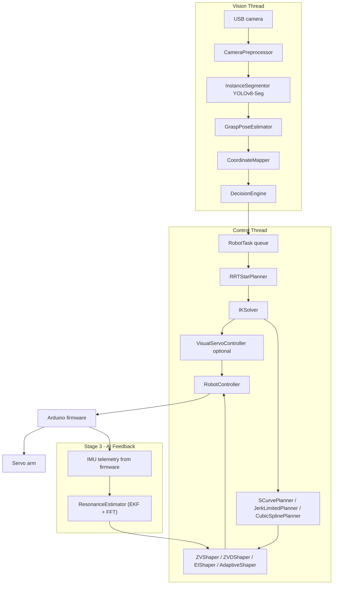

# System Architecture

This document describes the current AI Vision Robotic Arm runtime. The project
is organised as a two-thread Python pipeline with optional ROS 2 integration,
an Arduino firmware backend, and a three-stage input shaping system for
vibration-free motion.

## High-Level View



## Thread Responsibilities

### Vision Thread

Implemented in `ArmPipeline._vision_loop` (`src/main.py`).

1. Reads camera frames or RealSense color/depth frames.
2. Preprocesses frames with `CameraPreprocessor`.
3. Runs `InstanceSegmentor` to get masks, classes, centroids, and orientation.
4. Uses `GraspPoseEstimator` and `CoordinateMapper` to assign robot-frame XYZ.
5. Calls `DecisionEngine.decide(...)`.
6. Pushes actionable `RobotTask` objects into a queue with `maxsize=1`.
7. Draws the HUD overlay when `debug_video` is enabled.

### Control Thread

Implemented in `ArmPipeline._control_loop` (`src/main.py`).

1. Watches controller health via `RobotController.get_status()`.
2. Waits for a new `RobotTask` while idle.
3. Plans an approach path with RRT* when `path_planning.enabled` is set.
4. Solves IK for each waypoint via `IKSolver.solve()`.
5. Optionally runs closed-loop IBVS via `VisualServoController`.
6. Plans the joint-space trajectory with the configured planner.
7. Applies the input shaper (ZVD by default) before sending to the arm.
8. Moves to pick pose, closes the gripper, moves to drop pose, opens the
   gripper, and returns home.
9. Aborts to home if planning, IK, or controller state fails.

## State Machine (Control Thread)

```text
IDLE ──► PLANNING ──► APPROACH ──► SERVOING ──► PICKING ──► PLACING ──► HOMING ──► IDLE
           │               │                        │            │
           └──► ABORTING ◄─┘────────────────────────┘────────────┘
```

| State | Action |
| --- | --- |
| `IDLE` | Waits for new `RobotTask` from queue |
| `PLANNING` | RRT* Cartesian path from current EE to lift XYZ |
| `APPROACH` | IK per waypoint, step along RRT* path |
| `SERVOING` | Optional closed-loop visual servo to converge on target |
| `PICKING` | IK to pick XYZ, close gripper |
| `PLACING` | IK to drop XYZ, open gripper |
| `HOMING` | Return to `_HOME`, notify decision engine, reset task |
| `ABORTING` | Open gripper, return home, clear active task |
| `ERROR` | Attempt `clear_error()` and retry |

## Data Contracts

| Object | Producer | Consumer | Notes |
| --- | --- | --- | --- |
| `SegmentedObject` | `InstanceSegmentor` | `GraspPoseEstimator`, `DecisionEngine` | Class, mask, center, area, orientation, world_xyz |
| `GraspPose` | `GraspPoseEstimator` | Vision loop | XYZ and wrist angle |
| `Track` | `CentroidTracker` | `DecisionEngine` | Kalman-smoothed centroid and world position |
| `RobotTask` | `DecisionEngine` | Control thread | Target XYZ, drop XYZ, class, bin, priority |
| `JointAngles` | `IKSolver` | `RobotController`, trajectory planners | base, shoulder, elbow, wrist, gripper (degrees) |
| `TrajectoryPoint` | Trajectory planners | `RobotController.play_trajectory` | time `t`, `angles`, `vel[]`, `acc[]` |
| `Impulse` | Shaper `_build_impulses()` | `BaseShaper.apply()` | amplitude and delay_s |
| `IMUSample` | Serial firmware telemetry | `ResonanceEstimator` | ax, ay, az, gx, gy, gz |

## Main Modules

| Module | Purpose |
| --- | --- |
| `src/main.py` | CLI, dual-thread runtime, shaping-stack initialisation |
| `src/utils/config.py` | Dataclass config and YAML/env loading; includes `InputShapingConfig` |
| `src/utils/logger.py` | Loguru/Rich logger setup |
| `src/vision/preprocess.py` | Resize, undistort, optional CLAHE |
| `src/vision/segmentation.py` | YOLOv8-Seg masks, orientation via mask PCA |
| `src/vision/detect.py` | YOLOv8 box detector support |
| `src/vision/depth.py` | Depth backends (RealSense, MiDaS) and coordinate mapping |
| `src/vision/pose.py` | Grasp pose from mask + depth |
| `src/vision/tracker.py` | Kalman-smoothed centroid tracker |
| `src/logic/decision.py` | Task selection, bin routing, planning queue, cooldowns |
| `src/logic/quality_control.py` | Optional defect inspection (Laplacian, colour, solidity, ONNX) |
| `src/robotics/kinematics.py` | FK, analytical IK (4-DOF), SLSQP numerical IK, Jacobian, `DynamicInterceptor` |
| `src/robotics/path_planning.py` | Cartesian RRT* planner with greedy shortcutting |
| `src/robotics/trajectory.py` | `SCurvePlanner`, `JerkLimitedPlanner`, `CubicSplinePlanner`, `TrapezoidalPlanner` |
| `src/robotics/shaping.py` | `ZVShaper`, `ZVDShaper`, `EIShaper`, `AdaptiveShaper`, `build_shaper()` |
| `src/robotics/ai_estimator.py` | `FrequencyEstimator` (FFT), `RLSEstimator`, `KalmanEstimator` (EKF), `ResonanceEstimator` |
| `src/robotics/control.py` | Serial command queue, retry, heartbeat, IMU telemetry pipe, shaper injection |
| `src/robotics/visual_servo.py` | IBVS with three-axis PID and convergence window |
| `src/robotics/calibration.py` | Hand-eye calibration helpers |
| `scripts/measure_resonance.py` | Step-input resonance measurement; writes ωₙ/ζ to `config.yaml` |

## Input Shaping Pipeline

```text
JointAngles (start, end)
  └─► Trajectory Planner  (Stage 1: SCurvePlanner / JerkLimitedPlanner)
        └─► List[TrajectoryPoint]  (pos, vel, acc per joint @ 50 Hz)
              └─► Input Shaper  (Stage 2: ZVShaper / ZVDShaper / EIShaper)
                    └─► Shaped List[TrajectoryPoint]  (+settling tail)
                          └─► RobotController.play_trajectory()
                                └─► Serial JSON → Arduino → Servo arm
```

Stage 3 runs concurrently:

```text
Arduino IMU telemetry → IMUSample → ResonanceEstimator (EKF)
                                          └─► (ωₙ, ζ) estimate
                                                └─► AdaptiveShaper.update_params()
                                                       └─► recomputes ZVD impulses
```

### Stage 1: Trajectory Planners

| Class | Profile | Continuity | Jerk-limited |
| --- | --- | --- | --- |
| `SCurvePlanner` | Quintic polynomial | C2 | Yes — configurable `max_jerk` |
| `JerkLimitedPlanner` | Quintic / Sigmoid / Cubic | C2 or C1 | Effective (C2 endpoint constraints) |
| `CubicSplinePlanner` | Natural cubic spline | C1 | No |
| `TrapezoidalPlanner` | Cubic ease-in/out scaling | C1 (improved) | No |

All planners return `List[TrajectoryPoint]` with `t`, `angles`, `vel`, and `acc` fields.

### Stage 2: Input Shapers

All shapers inherit `BaseShaper` and implement `_build_impulses()`:

| Class | Impulses | Formula |
| --- | --- | --- |
| `ZVShaper` | 2 | Singer & Seering 1990 — exact ZV cancellation |
| `ZVDShaper` | 3 | Zeroes vibration and ∂V/∂ωₙ — robust to modelling errors |
| `EIShaper` | 3 | Extra-Insensitive — widest frequency tolerance band |
| `AdaptiveShaper` | wraps any above | Hot-swaps impulse sequence from EKF estimate |

`BaseShaper.apply(traj)` convolves each joint channel independently, extending
the trajectory by the longest impulse delay to allow settling.

### Stage 3: Resonance Estimators

| Class | Algorithm | Inputs | Best for |
| --- | --- | --- | --- |
| `FrequencyEstimator` | Windowed FFT + Hanning | IMU buffer | Offline calibration, FFT seed |
| `RLSEstimator` | Recursive Least Squares on 2nd-order ODE | Per-sample IMU | Fast convergence |
| `KalmanEstimator` | Extended Kalman Filter (4-state) | Per-sample IMU | Noise-robust production |
| `ResonanceEstimator` | Kalman + FFT seed façade | Per-sample IMU | Plug into `AdaptiveShaper` |

## Runtime Sequence

```text
camera frame
  → preprocess
  → segmentation (every N frames; tracker interpolates)
  → pose / depth mapping
  → tracker and decision engine
  → RobotTask queue (maxsize=1)
  → RRT* approach path (optional)
  → IK waypoints
  → optional visual servo
  → trajectory planner  ← Stage 1
  → input shaper        ← Stage 2 (ZVD by default)
  ↑ ← EKF resonance     ← Stage 3 (if adaptive=true and IMU available)
  → serial JSON commands
  → Arduino firmware
  → servo motion
```

## Configuration Sections

| Section | Used by |
| --- | --- |
| `camera` | Camera setup, visual servo target centre |
| `yolo` | Detection and segmentation confidence, class filter, input size |
| `robotics` | Serial, link lengths, speed, workspace bounds |
| `depth` | Depth backend and monocular calibration |
| `segmentation` | Segmentation model, fallback, frame skip, min mask area |
| `grasp_pose` | Pose confidence and depth-noise thresholds |
| `path_planning` | RRT* enable, planning parameters |
| `visual_servo` | Closed-loop PID gains and convergence settings |
| `quality_control` | Defect inspection settings |
| `input_shaping` | Planner, shaper, ωₙ, ζ, Stage 3 adaptive toggle and estimator |

## Failure Handling

- Camera read failure stops the vision loop.
- Full task queue causes the active target XYZ to update in-place instead of
  queuing a stale task.
- Controller `ERROR` state triggers `clear_error()` and pauses the control loop.
- RRT* failure moves the task to `ABORTING`.
- IK failure during approach, picking, or placing aborts to home.
- Lost or drifting active target can generate `TaskType.ABORT` or
  `TaskType.RECOVERING`.
- Shaping errors are caught and logged; the unshaped trajectory is used as a
  safe fallback so the arm still moves.
- Estimator errors in `AdaptiveShaper._maybe_update_params()` are caught and
  logged; the shaper retains the last valid parameters.

## Testing Map

| Area | Test file | Count |
| --- | --- | --- |
| IK and reachability | `tests/test_kinematics.py` | — |
| Tracking | `tests/test_tracker.py` | — |
| Trajectory planners + shapers + estimators | `tests/test_trajectory.py` | 45 |
| Decisions and bin routing | `tests/test_decision.py` | — |
