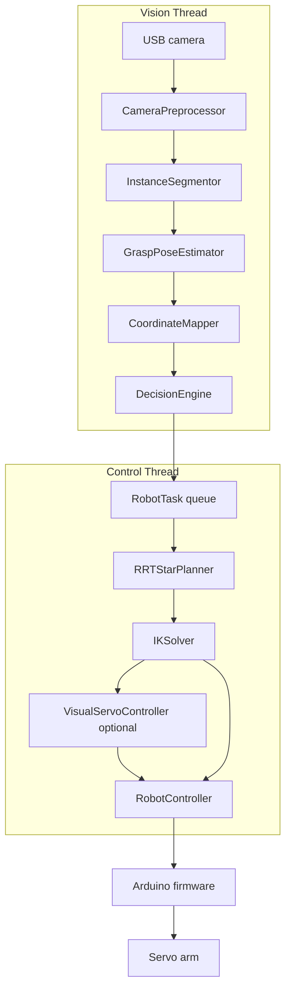

# System Architecture

This document describes the current AI vision robotic arm runtime. The project
is organized as a two-thread Python pipeline with optional ROS 2 and Arduino
firmware integration.

## High-Level View



## Thread Responsibilities

### Vision Thread

Implemented in `ArmPipeline._vision_loop`.

1. Reads camera frames or RealSense color/depth frames.
2. Preprocesses frames with `CameraPreprocessor`.
3. Runs `InstanceSegmentor` to get masks, classes, centroids, and orientation.
4. Uses `GraspPoseEstimator` and `CoordinateMapper` to assign robot-frame XYZ.
5. Calls `DecisionEngine.decide(...)`.
6. Pushes actionable `RobotTask` objects into a queue with `maxsize=1`.
7. Draws the HUD when `debug_video` is enabled.

### Control Thread

Implemented in `ArmPipeline._control_loop`.

1. Watches controller health.
2. Waits for a new `RobotTask` while idle.
3. Plans an approach path with RRT* when enabled.
4. Solves IK for each waypoint.
5. Optionally runs visual servoing.
6. Moves to pick pose, closes the gripper, moves to drop pose, opens the
   gripper, and returns home.
7. Aborts to home if planning, IK, or controller state fails.

## Data Contracts

| Object | Producer | Consumer | Notes |
| --- | --- | --- | --- |
| `SegmentedObject` | `InstanceSegmentor` | `GraspPoseEstimator`, `DecisionEngine` | Includes class, mask, center, area, orientation |
| `GraspPose` | `GraspPoseEstimator` | Vision loop | Supplies XYZ and wrist angle |
| `Track` | `CentroidTracker` | `DecisionEngine` | Smooths centroid/world position and confidence |
| `RobotTask` | `DecisionEngine` | Control thread | Contains target XYZ, drop XYZ, class, bin, priority |
| `JointAngles` | `IKSolver` | `RobotController`, trajectory planners | Base, shoulder, elbow, wrist, gripper degrees |
| `TrajectoryPoint` | trajectory planners | `RobotController.play_trajectory` | Time, joint angles, velocities |

## Main Modules

| Module | Purpose |
| --- | --- |
| `src/main.py` | CLI and dual-thread runtime |
| `src/utils/config.py` | Dataclass config and YAML/env loading |
| `src/utils/logger.py` | Loguru/Rich logger setup |
| `src/vision/preprocess.py` | Resize, undistort, optional CLAHE |
| `src/vision/segmentation.py` | YOLOv8-Seg masks and orientation |
| `src/vision/detect.py` | YOLOv8 box detector support |
| `src/vision/depth.py` | Depth backends and coordinate mapping |
| `src/vision/pose.py` | Grasp pose from mask + depth |
| `src/vision/tracker.py` | Kalman-smoothed centroid tracker |
| `src/logic/decision.py` | Task selection, bin routing, planning queue |
| `src/logic/quality_control.py` | Optional defect inspection |
| `src/robotics/kinematics.py` | FK, analytical IK, numerical IK, Jacobian |
| `src/robotics/path_planning.py` | Cartesian RRT* planner |
| `src/robotics/trajectory.py` | Cubic spline and trapezoidal trajectories |
| `src/robotics/control.py` | Serial command queue and arm API |
| `src/robotics/visual_servo.py` | Optional closed-loop visual servoing |
| `src/robotics/calibration.py` | Hand-eye calibration helpers |

## Runtime Sequence

```text
camera frame
  -> preprocess
  -> segmentation
  -> pose/depth mapping
  -> tracker and decision engine
  -> RobotTask queue
  -> RRT* approach path
  -> IK waypoints
  -> optional visual servo
  -> serial JSON commands
  -> Arduino firmware
  -> servo motion
```

## Configuration Sections

| Section | Used by |
| --- | --- |
| `camera` | camera setup, visual servo target center |
| `yolo` | detection and segmentation confidence, class filter, input size |
| `robotics` | serial, link lengths, speed, workspace bounds |
| `depth` | depth backend and monocular depth calibration |
| `segmentation` | segmentation model path, fallback, frame skip, min mask area |
| `grasp_pose` | intended pose confidence and depth-noise thresholds |
| `path_planning` | RRT* enable flag and planning parameters |
| `visual_servo` | closed-loop approach settings |
| `quality_control` | defect inspection settings |

## Failure Handling

- Camera read failure stops the vision loop.
- Full task queue causes the active target XYZ to update instead of adding a
  stale task.
- Controller `ERROR` state triggers `clear_error()` and pauses the control loop.
- RRT* failure moves the task to aborting.
- IK failure during approach, picking, or placing aborts to home.
- Lost/drifting active target can generate `TaskType.ABORT` or
  `TaskType.RECOVERING`.

## Testing Map

| Area | Test file |
| --- | --- |
| IK and reachability | `tests/test_kinematics.py` |
| Tracking | `tests/test_tracker.py` |
| Trajectories | `tests/test_trajectory.py` |
| Decisions and routing | `tests/test_decision.py` |
